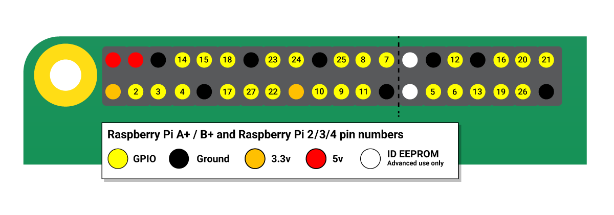

# UI & Controller for PBL TeaServer Project

This program uses the Gemini API to interact with users and determine a suitable type of tea and flavorings for them.

# Architecture

* Frontend: HTML/JavaScript
* Backend: Python's FastAPI + Gemini API

## How to use

1. Clone repository  
    ```bash
    git clone https://github.com/2025-pbl-zenki-7/controller.git 
    ```

2. Setup environment
    ```bash
    cd controller
    poetry install

    # Gemini API key
    echo "GEMINI_API_KEY={your_api_key}" > .env
    ```

3. Run
    ```bash
    poetry run python main.py

    google-chrome --app=http://127.0.0.1:8000 --start-maximized --disable-infobars
    ```


## Wiring

#### Raspberry Pi 5

| Function | GPIO Number |
| -------- | ---------- |
| Conveyor Motor 1+ | 17 |
| Conveyor Motor 1- | 27 |
| Conveyor Motor 2+ | 22 |
| Conveyor Motor 2- | 23 |
| Conveyor Motor 3+ | 24 |
| Conveyor Motor 3- | 25 |
| Lift's Servo Motor | 18 |
| Kettle's Relay | 4 |



